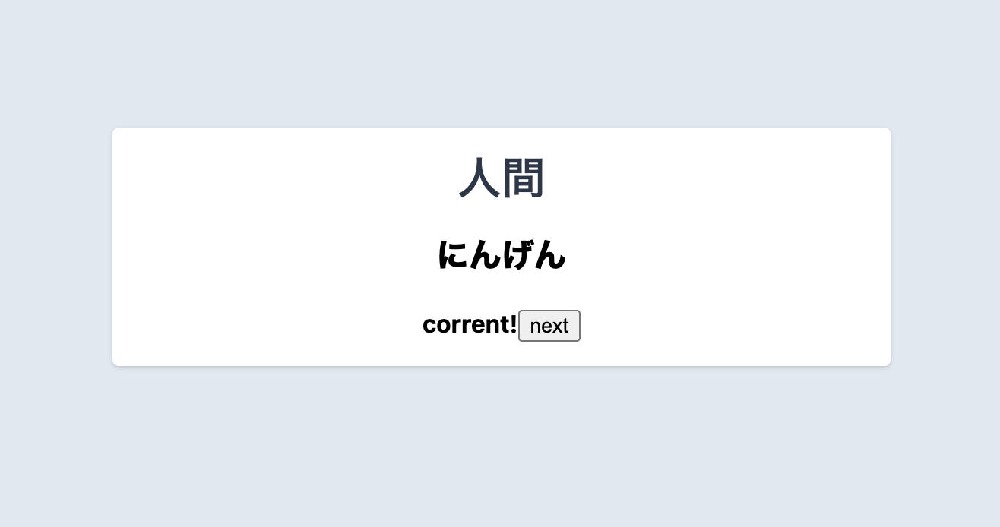

# Yomikata 「読み方」
Practice and learn the readings of words in Japanese
漢字の読み方を教えると単語練習のアプリです

- [Yomikata 「読み方」](#yomikata-読み方)
  - [Status](#status)
  - [Getting Started](#getting-started)
    - [Setup](#setup)
    - [Fire it up](#fire-it-up)

## Status
Work in progess



## Getting Started
This project uses redwoodjs

- [Tutorial](https://redwoodjs.com/tutorial/welcome-to-redwood): getting started and complete overview guide.
- [Docs](https://redwoodjs.com/docs/introduction): using the Redwood Router, handling assets and files, list of command-line tools, and more.

### Setup

We use Yarn as our package manager. To get the dependencies installed, just do this in the root directory:

```terminal
yarn install
```

### Fire it up

```terminal
yarn redwood dev
```

Your browser should open automatically to `http://localhost:8910` to see the web app. Lambda functions run on `http://localhost:8911` and are also proxied to `http://localhost:8910/.redwood/functions/*`.
